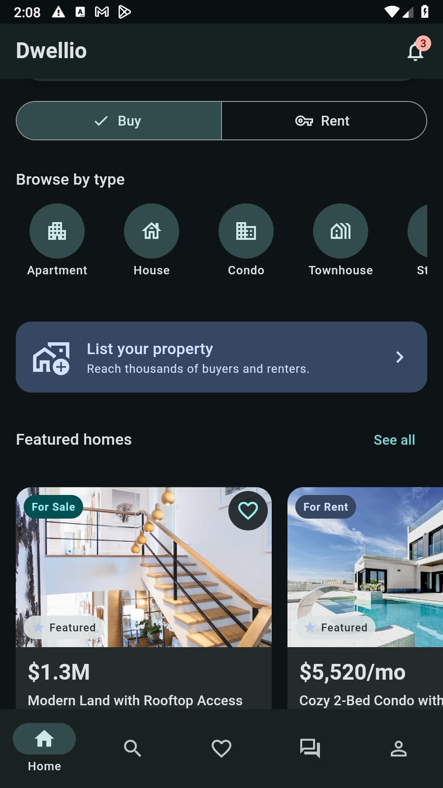
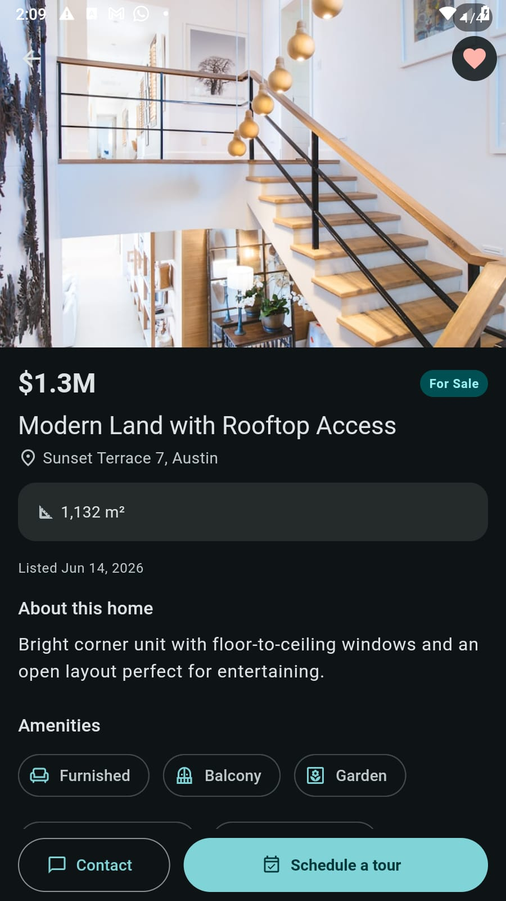
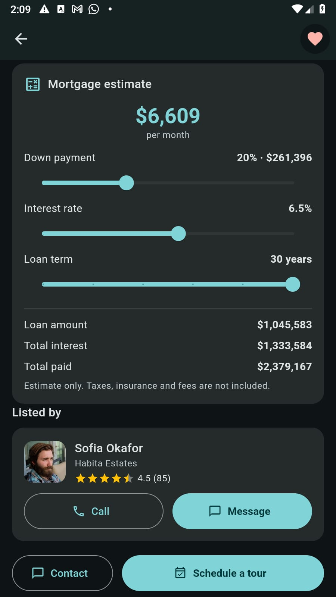
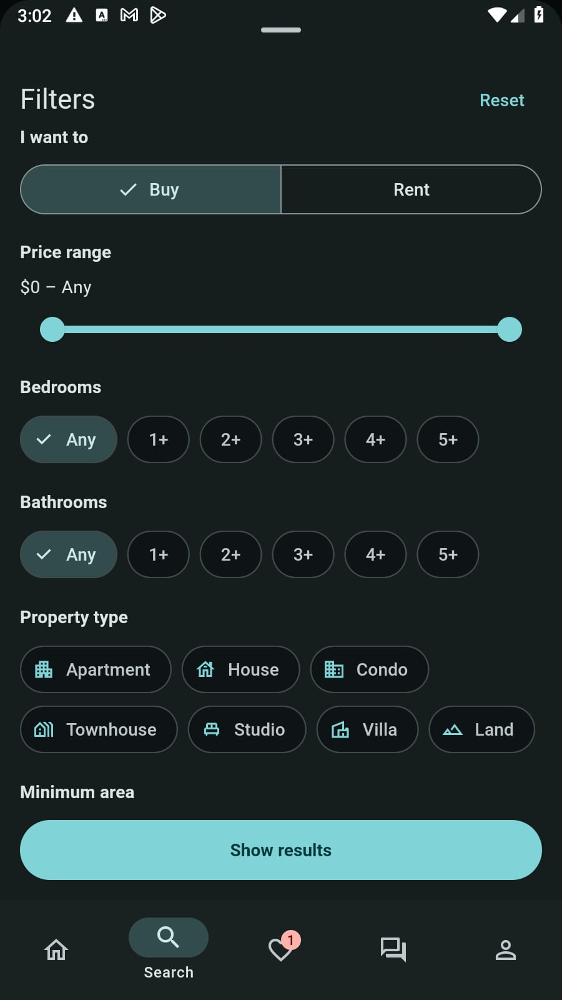
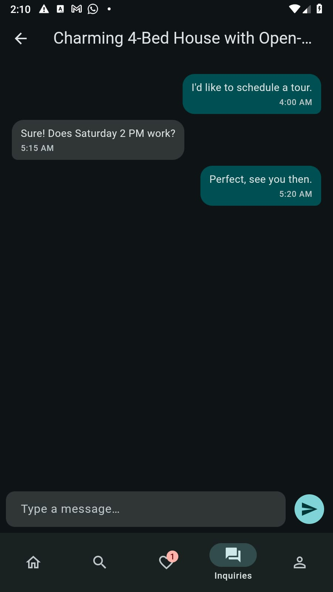

<div align="center">

# Dwellio 🏡

### Find your Dwellio.

A production-quality, **cross-platform real-estate app** built with Flutter — one
codebase running on **iOS, Android, Web, macOS, Windows, and Linux**.

Strictly **Material 3 (Material You)** · fully **adaptive** (phone → tablet → desktop) ·
backed by a **mock REST API** through a real networking + repository layer.


</div>

---

## 📖 Overview

**Dwellio** is a polished property-search experience — browse homes to **buy or rent**,
explore them on an **interactive map**, dive into rich listing details with a **live
mortgage calculator**, save favorites, schedule tours, message agents, and even **list
your own property**.

It’s built to production standards, not as a toy:

- **No hardcoded data in the UI.** Every screen pulls from repositories that talk to a
  runnable mock REST API (`json-server`) over **Dio + Retrofit**, with typed `freezed`
  models. Loading (shimmer), empty, and error states are everywhere — the network layer
  even injects realistic latency and occasional failures so those states are real.
- **Every flow is wired end to end.** Search (including **map-bounds search**) → listing
  detail → **favorite** (persists) → **schedule a tour / contact an agent** → it appears
  in *My Inquiries*. Saved searches and favorites survive app restarts. The **Sell** flow
  publishes a listing that then shows up in search and *My listings*.
- **Genuinely adaptive.** A bottom `NavigationBar` on phones becomes a `NavigationRail`
  on tablets and an extended rail + **split map/list view** on desktop & web.
- **Material You done right.** Light / dark / **platform dynamic color**, centralized
  theme + design tokens, M3 components throughout (`SearchBar`, `SegmentedButton`,
  `FilterChip`, `NavigationBar`, bottom sheets, `Badge`, …).

> **Branding** — seed color estate teal-green `#00696D`; “Dwellio” wordmark in M3
> `headlineMedium`; a house-with-keyhole launcher icon (generated for all six platforms).

---

## 📱 Screenshots

<div align="center">

| Home | Listing detail | Mortgage & agent |
|:---:|:---:|:---:|
|  |  |  |
| Buy/Rent toggle, type shortcuts, featured homes | Photo gallery, specs, amenities, sticky actions | Live mortgage estimate + agent rating |

| Filters | Inquiries (mock chat) |
|:---:|:---:|
|  |  |
| M3 filter sheet: price range, beds/baths, property type | Tour & agent threads with a live composer |

</div>

---

## ✨ Features

- 🔎 **Search & filter** — text search, price range, beds/baths, property type, min area,
  amenities, and sort (price / newest / area).
- 🗺️ **Linked map & list** — pan/zoom **re-queries listings by viewport bounds**; tapping a
  pin highlights and scrolls to its card (and vice-versa); pins **cluster** at low zoom.
  Built on `flutter_map` + OpenStreetMap — works on **all six platforms, no API key**.
- 🏠 **Rich listing detail** — swipeable photo gallery, specs, amenities grid, mini-map,
  agent card (call / message), **live mortgage estimator**, and a “similar homes” rail.
- ❤️ **Favorites & saved searches** — persist across launches.
- 📅 **Tours & inquiries** — schedule a viewing or message an agent; both show up in
  *My Inquiries* with a mock chat thread.
- 🔐 **Auth gating with resume** — browse as a guest; favoriting, tours, messaging and
  listing require login. You’re redirected to sign in and the action **resumes automatically**.
- 📤 **Sell flow** — a multi-step wizard that publishes a listing into search & *My listings*.
- 🔔 **Notifications** — price drops, tour confirmations, new matches (read/unread).
- 🎨 **Theme & locale** — light / dark / system + dynamic color; English / Español; both persist.

---

## 🧰 Tech stack

| Concern    | Choice |
|------------|--------|
| UI         | Flutter (stable), **Material 3**, `dynamic_color` |
| State      | **Riverpod 3** (`flutter_riverpod` + `riverpod_annotation` codegen) |
| Routing    | `go_router` (shell route, deep links, web URLs, auth redirect) |
| Networking | `dio` + `retrofit`, models via `freezed` + `json_serializable` |
| Map        | `flutter_map` (OpenStreetMap) + `flutter_map_marker_cluster` |
| Images     | `cached_network_image`, swipeable gallery |
| Storage    | `flutter_secure_storage` (token), `shared_preferences` (theme/locale/onboarding) |
| Formatting | `intl` |
| Icon       | `flutter_launcher_icons` (generated for all platforms) |

`flutter_map` is used deliberately instead of `google_maps_flutter`, which has incomplete
web/desktop support and would break the “all platforms” goal.

---

## 🏗️ Architecture

Feature-first **clean architecture**. Repositories expose domain models; Riverpod
controllers hold UI/search/map state and call repositories. **JSON shapes never leak into
widgets.**

```
lib/
  core/            # env, theme + design tokens, router, dio client, interceptors, utils
  data/            # freezed models, retrofit api client, repositories (+ providers)
  features/
    auth/ onboarding/ home/ search/ map/ listing/
    favorites/ saved_searches/ inquiries/ sell/ account/ notifications/
      application/   # Riverpod controllers (state)
      presentation/  # screens + feature widgets
  shared/widgets/  # listing card, filter sheet, adaptive scaffold, loading/empty/error
  app.dart         # MaterialApp.router + theming + dynamic color
  main.dart        # bootstrap (SharedPreferences) + ProviderScope
backend/           # FastAPI backend + Next.js/MUI admin (own repo / submodule)
test/              # mortgage math, filter→query mapping, repository (mocked Dio)
```

---

## 🚀 Getting started

### 1. Run the backend API

The app is served by the **FastAPI backend** in [`backend/`](backend/) (it replaces the
original json-server mock — that data was migrated into the backend's seed). See
[backend/README.md](backend/README.md) for full instructions:

```bash
cd backend
make setup && make migrate && make seed && make run   # API on http://localhost:8000
```

It exposes the exact same paths, query params and JSON shapes the app expects, including
**map-bounds search** (`swLat,swLng,neLat,neLng`), all filters, `/listings/:id/similar`,
favorites, tours, inquiries, notifications, plus server-side mortgage/derived values and a
staff-only `/admin-api` powering the Next.js admin dashboard.

**Demo account** (seeded, pre-filled on the login screen): `demo@dwellio.app` / `password`
(staff/admin: `admin@dwellio.app` / `password`).

> The `ChaosInterceptor` injects **300–800 ms latency and occasional failures** by default
> so loading/error states are exercised. Disable with
> `--dart-define=DWELLIO_SIMULATE_NETWORK=false`.

### 2. Run the app

```bash
flutter pub get
dart run build_runner build --delete-conflicting-outputs   # freezed / json / retrofit / riverpod

flutter run -d chrome     # or: windows · macos · linux · a device
```

### 3. Point the app at your API

The backend runs on port **8000**. Override the base URL per-run, no code change:

```bash
flutter run --dart-define=DWELLIO_API_BASE_URL=http://localhost:8000
```

| Target            | `DWELLIO_API_BASE_URL` |
|-------------------|------------------------|
| Web / desktop     | `http://localhost:8000` |
| Android emulator  | `http://10.0.2.2:8000` |
| iOS simulator     | `http://localhost:8000` |
| Physical device   | `http://<your-machine-LAN-ip>:8000` |

---

## 📐 Adaptive layout

| Width            | Navigation                | Search layout                        | Grid |
|------------------|---------------------------|--------------------------------------|------|
| `< 600` compact  | bottom `NavigationBar`    | list **or** full-screen map (toggle) | 1–2 |
| `600–840` medium | `NavigationRail`          | list with map toggle                 | 2–3 |
| `> 840` expanded | extended `NavigationRail` | **split: results ⟷ map**             | 3+  |

---

## 🧪 Tests

```bash
flutter test      # mortgage math, filter→query mapping, repository (mocked Dio)
flutter analyze   # zero issues
```

---

## 🖼️ App icon

The launcher icon (a white house with a keyhole on the brand teal) is reproducible:

```bash
python assets/icon/make_icon.py      # regenerate the source art
dart run flutter_launcher_icons      # regenerate platform icons
```

---

## 🪟 Platform notes

- **Windows desktop / Android builds on Windows** require *Developer Mode* (plugin
  symlinks): `start ms-settings:developers`.
- If your project and the Flutter pub cache live on **different drives** (e.g. `E:` vs
  `C:`), Android Kotlin incremental compilation can crash; this repo sets
  `kotlin.incremental=false` in `android/gradle.properties` to avoid it.
- **Web/desktop** need internet access for OpenStreetMap tiles and listing photos
  (cached after first load).

---

## 🏷️ Rebranding

To rename (e.g. **Roost**, **Casavia**, **Habita**): update `name` in `pubspec.yaml`, the
title in `lib/app.dart`, the wordmark in `auth_header.dart` and `app_scaffold.dart`, and
this README. Change the seed color in `lib/core/theme/app_theme.dart`
(`AppTheme.seedColor`), then regenerate the icon.
